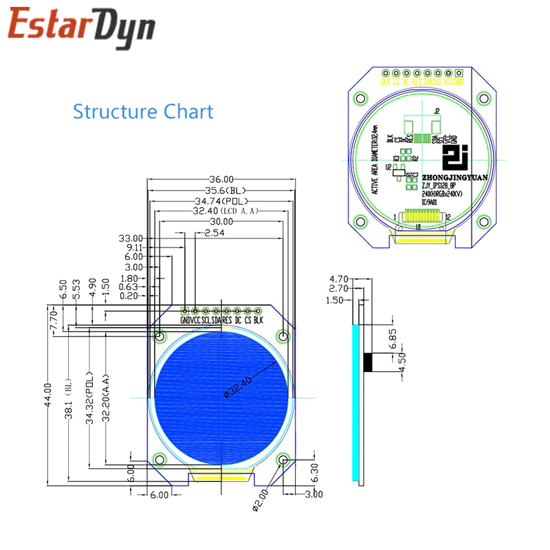

# Bare Metal Display

Simple graphic library  
Based on Raspberry Pi Pico board and PICO SDK (C++)

## Brief

Pico PI boards looks nice for embedded controllers with graphic displays. But I can't find useful solution for me,
because most of founded used with Arduino IDE (don't like it) or python (I prefer c/cpp for embedded devices).  
So I decided to write my own  

Now I'm use round display based on GC9A01 (because I need to create controller for rare transceiver).
I hope solution may be applicable for other displays/controllers, so used polymorphism cpp

**WARNING!**  
For now most of the methods not tested properly. Boundary testing required at least. 
But now I haven't SWD debugger for manual tests, and don't know how to write unit tests on cpp

## Display GC9A01

Round TFT display from aliexpress:  
*DC 3.3V 1.28 inch TFT LCD Display Module Round RGB IPS HD 240x240 Resolution GC9A01 Driver 4 Wire SPI Interface Adapter Board*  

Pinout:  

| GC9A01 | Pico   |
|--------|--------|
| GND    | GND    |
| VCC    | 3V3    |
| SCL    | GP2    |
| SDA    | GP3    |
| RES    | GP19   |
| DC     | GP18   |
| CS     | GP20   |
| BLK    | GP17   |

**Image converter**  
Convert image to bitmap, cloned from https://gitlab.com/dec0de-consulting/pico-badge  
... and modified  
Required PNG image in 240x240 px resolution  
Convert image with command:  
`./convert.sh image.png` 
Result file is *.h, contains array of 16-bit values. Array size - 57600 elements  

**Fonts**
Some info about fonts
https://learn.microsoft.com/en-us/windows/win32/gdi/raster--vector--truetype--and-opentype-fonts

Generally, we want to convert ttf font from your PC to bitmap. We can find a lots of solutions:
desktop applications, online converters, and scripts.

My choice is python scripts, because:
- no need compilation
- online resource can break down at any time
- I cat put python script to my repo

Some scripts what I found useful:

Only fixed font size. Could convert to 8 bit, 24 bit height, but if I need 16 bit??  
[TTF2BMH](https://github.com/jdmorise/TTF2BMH)

Looks better, because I can put many .ini files for different fonts, 
and create my own templates (to use classes instead structures, etc.)  
[font2c](https://github.com/sfyip/font2c)

The last converter I modified and copy to my repo